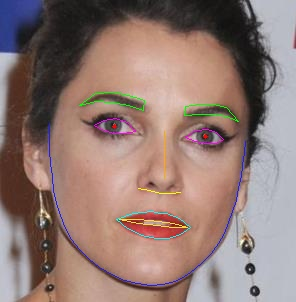

# facial_landmark
人脸 98 个关键点检测   

## 项目介绍    
注意：该项目不包括人脸检测部分，人脸检测项目地址：https://github.com/XIAN-HHappy/yolo_v3

* 图片示例：  
    

* 视频示例：  
    

## 项目配置  
* 作者开发环境：  
* Python 3.7  
* PyTorch >= 1.5.1  

## 数据集  
* 数据集官方地址：  
  https://wywu.github.io/projects/LAB/WFLW.html  

```
  @inproceedings{wayne2018lab,  
  author = {Wu, Wayne and Qian, Chen and Yang, Shuo and Wang, Quan and Cai, Yici and Zhou, Qiang},  
  title = {Look at Boundary: A Boundary-Aware Face Alignment Algorithm},  
  booktitle = {CVPR},  
  month = June,  
  year = {2018}  
  }   
```
  该数据集对于人脸的关键点定义如下图（图片如侵权请联系删除）:  

      


* [该项目制作的训练集的数据集下载地址(百度网盘 Password: qruc )](https://pan.baidu.com/s/1DyFDviOEtmk0gb4N0cYHEw)    


## 预训练模型   
* [预训练模型下载地址(百度网盘 Password: 5twg )](https://pan.baidu.com/s/1Psz-xsb3S07A1hnz0wQ4fw)     

## 项目使用方法   

### 模型训练     
* 根目录下运行命令： python train.py     (注意脚本内相关参数配置 )   

### 模型推理    
* 根目录下运行命令： python inference.py   (注意脚本内相关参数配置  )  
